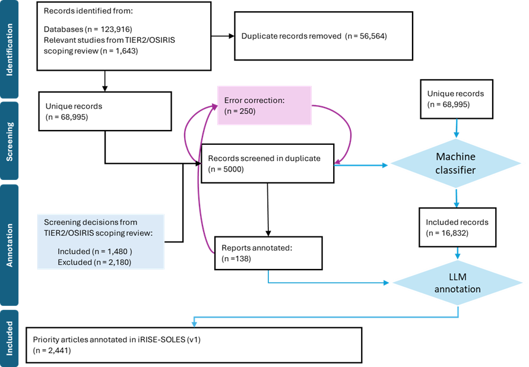
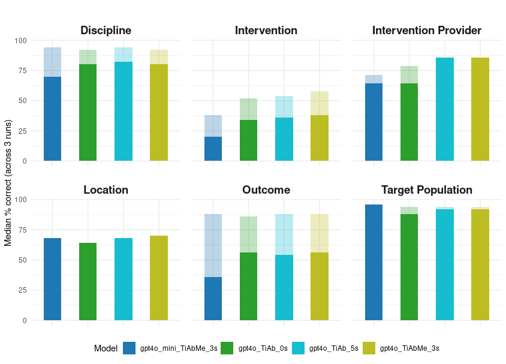

```{=html}
<style>
.list-group-item.active, .list-group-item.active:focus, .list-group-item.active:hover {
    background-color: #1A465F;
}

body, h1, h2, h3, h4, h5, h6, p {
  font-family: 'KohinoorBangla', sans-serif !important;
}

</style>
```
## Identifying relevant evidence

Guided by a pre-registered [protocol](https://osf.io/2vufx/?view_only=d74ff8089864468cb43daa06733e0be6), we performed a wide-ranging search in January 2024 spanning multiple databases to identify research of interest. Our full search strategy is available [here](https://osf.io/kawfz/?view_only=d74ff8089864468cb43daa06733e0be6).

In total, we identified 123,916 articles. We used the Automated Systematic Search Deduplicator [(ASySD)](https://bmcbiol.biomedcentral.com/articles/10.1186/s12915-023-01686-z) to identify and remove duplicates automatically. After deduplication, we had 68,995 articles.

We are now planning to use application programming interfaces (APIs) to automatically retrieve studies on an ongoing basis from PubMed, Web of Science, and Scopus. We are currently investigating ways to automate retrieval from other sources.

## Screening for inclusion

We want to include articles in iRISE SOLES which **evaluate an intervention to improve reproducibility and/or reproducibility proxies**. Reproducibility proxies are measures which are likley to lead to improvements in reproducibility indirectly, such as data-sharing, open science practices, and adherence to guidelines to improve transparency. For a more detailed description of our inclusion criteria, please see our [protocol](https://osf.io/2vufx/?view_only=d74ff8089864468cb43daa06733e0be6).

From the 68,995 unique articles identified, we took a sample of 5000 articles, oversampling for studies that were in the title/abstract screening phase of an [ongoing scoping review](). We imported 5000 articles into our online systematic review platform, SyRF. Prior screening decisions from the scoping review were imported as "Screener 1", when available. Each article was screened in duplicate. These decisions were used to train a support vector machine learning classifier hosted by our collaborators at University College London. Screening decisions and accompanying titles/abstracts are split into "train" and "test" datasets, where the train dataset is used by the machine to "learn" from the words/phrases in the text and associate these to the classifications (included / excluded). The test dataset is used to test the machine's performance by comparing the machine decision to a human decision. From this, we obtained an initial sensitivity (% of studies included / all studies that should be included) of 95% and a specificity (% of studies excluded that should be excluded) of 72%. We conducted an error correction process, re-screening 250 articles where the machine and human disagreed. Following this exercise, specificity improved to 77%. 

Once the machine classifier was deemed good enough, we applied this to the remainder of the dataset to obtain 16,832 included articles.

**Figure 1: Article selection process**
  

As new articles enter into the iRISE-SOLES workflow from the API-enabled searches, they will be screened for inclusion using the same classifer. We may re-train or improve this classifier over time to ensure it continues to perform well on new research in this domain.  


## Automated article annotation  

To automatically annotate articles included in iRISE-SOLES, we  decided to utilise the power of large language models. We have found GPT-4o, the latest model from OpenAI, particularly suited to this task. 

We have developed a framework to easily compare the performance of using the article's Title and Abstract versus using the Title, Methods, and Abstract. This also allowed us to compare the performance between the large language models.

For each article, we wanted to automate the annotation of:
- the intervention (to improve reproducibility) evaluated or suggested
- the reproducibility relevant outcomes measured
- the intervention provider
- the target population the intervention was applied to (including target location and discipline)

For each of these annotations, we had a list of categories for humans and the large language model to choose from. 

We used a sample of n=44 human annotated studies for training and development and evaluated performance on an unseen set of n=50 studies. The performance has been measured by comparing the model's results to the human results, labelling each result as correct, partially correct or incorrect. Correct, meaning the machine returned the exact same result as the human. Partial if 1 or more of the results matched the human annotation (for example, if there were 3 outcome measures and the machine correctly identified 2 of them.) Incorrect if the machine returned a completely different result to the human.

**Figure 2: Performance measured as the median percentage correct and partially correct on 50 unseen test articles**
*Solid colour bars indicate the percentage of correct classifications. Transparent bars indicate the additional percentage of partially correct annotations. Zero-shot (0s), 3-shot (3s), and 5-shot (5s) GPT4o approaches were evaluated. TiAb (Title and Abstract used), TiAbMe (Title, Abstracts, and Methods sections used).*
 

We noticed that these apporaches appear to work best in studies which directly evaluate an intevention to improve reproducibility using experimental approaches or controlled (pre/post) observational studies (we call these type I studies). They did not work as well for cross-sectional studies, theoretical frameworks, and other types of research (type II studies). We evaluated how well large language models could differentiate between type I and type II studies. Using GPT4o-mini, a binary classifier to detect type I studies performed with a sensitivity of 71.4% and a specificity of 87.2%. We applied this to the entire dataset to obtain 2,441 priority type I studies to annotate in full in this first verison of the platform. We will conduct further testing before applying to the entire dataset or expanding our annotation scope.   

In the current version of iRISE-SOLES, only annotations which match with our initial list of categories or added by human reviewers are shown in the visualisations. Where the large language model has generated a supplementary annotation, we denote this "other". We are currently developing a workflow for how to check the relevance of these annotations and the articles they belong to. Annotations denoted as "unknown" are those which have not yet been annotated by a human or machine. 

**Example prompt:**

{Intervention : string // What intervention has been evaluated in this study? Select the fewest number of options possible, almost exclusively from the Interventions list but if this is not comprehensive enough you can provide up to one additional intervention,\\n}


## Other integrations and tools

Using a custom-made tool as part of our solesR package (https://github.com/camaradesuk/solesR/), we retrieved full text PDFs from CrossRef, Unpaywall, Elsevier, and Wiley using APIs. Full texts were converted to text using pdftotext, as part of the AutoAnnotation R package. We then ran the OddPub tool to extract data and code sharing statements from included articles. Using the OpenAlex API (via the OpenAlexR package), we obtained additional metadata from published work including open access status, funder information, geographical location and institution of the first author, and institution type. 

## WCRI Presentation

We recently presented iRISE-SOLES at the World Conference for Research Integrity 2024! Please check out our slides [on the Open Science Framework]().
