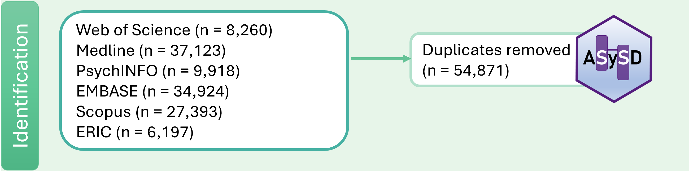
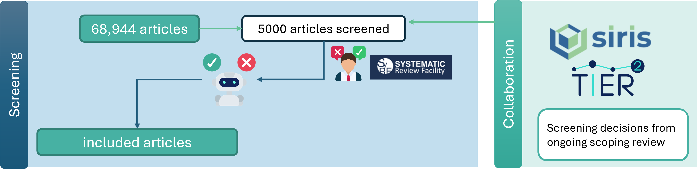

```{=html}
<style>
.list-group-item.active, .list-group-item.active:focus, .list-group-item.active:hover {
    background-color: #1A465F;
}

body, h1, h2, h3, h4, h5, h6, p {
  font-family: 'KohinoorBangla', sans-serif !important;
}

</style>
```
## Identifying relevant evidence

Guided by a pre-registered [protocol](https://osf.io/2vufx/?view_only=d74ff8089864468cb43daa06733e0be6), we performed a wide-ranging search in January 2024 spanning multiple databases to identify research of interest. Our full search strategy is available [here](https://osf.io/kawfz/?view_only=d74ff8089864468cb43daa06733e0be6).

In total, we identified 123,815 articles. We used the Automated Systematic Search Deduplicator [(ASySD)](https://bmcbiol.biomedcentral.com/articles/10.1186/s12915-023-01686-z) to identify and remove duplicates automatically. After deduplication, we had 68,944 articles.



Once we had run this initial search, we used application programming interfaces (API) to automatically retrieve studies on an ongoing basis from PubMed, Web of Science, and Scopus. We are currently investigating ways to automate retrieval from other sources.

## Screening for inclusion

We want to include articles in iRISE SOLES which **evaluate an intervention to improve reproducibility and/or reproducibility proxies**. Reproducibility proxies are measures which are likley to lead to improvements in reproducibility indirectly, such as data-sharing, open science practices, and adherence to guidelines to improve transparency. For a more detailed description of our inclusion criteria, please see our [protocol](https://osf.io/2vufx/?view_only=d74ff8089864468cb43daa06733e0be6).

From the 68,944 unique articles identified, we took a sample of 5000 articles, oversampling for studies that were included at the title/abstract screening phase of an [ongoing scoping review](). The decisions from this review were used as "Screener 1", when available. Each article was screened in duplicate. These decisions were used to train a support vector machine learning classifier hosted by our collaborators at Univesity College London. Screening decisions and accompaying titles/abstracts are split into "train" and "test" datasets, where the train dataset is used by the machine to "learn" from the words/phrases in the text and associate these to the classifications (included / excluded). The test dataset is used to test the machine's performance by comparing the machine decision to a human decision. From this, we obtained an initial sensitivity (% of studies included / all studies that should be included) of 95% and a specificity (% of studies excluded that should be excluded) of xx%.



Once the machine classifier was deemed good enough, we applied this to the remainder of the dataset to obtain xx included articles.

As new articles enter into the iRISE-SOLES workflow from the API-enabled searches, they will be screened for inclusion using the same classifer. We may re-train or improve this classifier over time to ensure it continues to perform well on new research in this domain.

## Manual article annotation

## Automated article annotation

For our primary approach to automated data annotation we have decided to utilise the power of large language models. In particular we are using GPT-4o, which is the latest model from OpenAI.

We initially used 10 studies as training for prompt engineering. This is where we fine tuned our queries to optimise the model’s performance. We did this by providing the model with lists of each entity we aimed to extract (such as interventions, disciplines, outcome measures etc), and asking it to annotate the corresponding fields. 

**Example prompt:**

{Intervention : string // What intervention has been evaluated in this study? Select the fewest number of options possible, almost exclusively from the Interventions list but if this is not comprehensive enough you can provide up to one additional intervention,\\n}

We have developed a framework to easily compare the performance of using the article's Title and Abstract versus using the Title, Methods, and Abstract. This also allows us to compare the performance between the OpenAI models. 

When we were happy we had optimised our prompts for maximum performance, we tested them on an additional 25 papers, each of which had been annotated by 2 humans and reconciled by a 3rd. The performance has been measured by comparing the model’s results to the human results, labelling each result as correct, partial or incorrect. Correct, meaning the machine returned the exact same result as the human. Partial if 1 or more of the results matched up. For example, if there were 3 outcome measures and the machine correctly identified 2 of them. Incorrect if the machine returned a completely different result to the human. 


This is our current performance on the 35 annotated studies we have, using the Title, Abstract, and Methods sections processed through the GPT-4o API. We have not yet applied this to the entire dataset, as we believe we can improve the performance further.

Currently, we are running a zero-shot approach, meaning that we do not train the model at all prior to running the prompts. For our next steps we plan on training the model, providing it with example texts and annotations, which should improve performance.


## Other integrations and tools

## WCRI Presentation

We recently presented iRISE-SOLES at the World Conference for Research Integrity 2024! Please check out our slides [on the Open Science Framework]().
